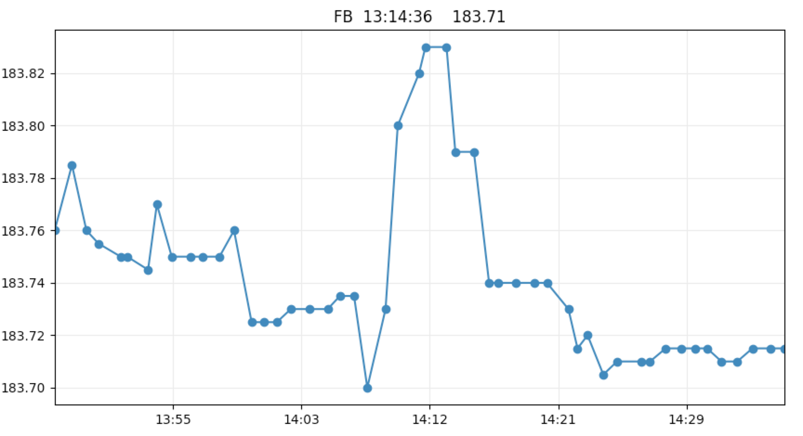

# Command Line Interface for ETrade accounts in python

THE SOFTWARE IS PROVIDED "AS IS", WITHOUT WARRANTY OF ANY KIND, EXPRESS OR
IMPLIED, INCLUDING BUT NOT LIMITED TO THE WARRANTIES OF MERCHANTABILITY,
FITNESS FOR A PARTICULAR PURPOSE AND NONINFRINGEMENT. IN NO EVENT SHALL THE
AUTHORS OR COPYRIGHT HOLDERS BE LIABLE FOR ANY CLAIM, DAMAGES OR OTHER
LIABILITY, WHETHER IN AN ACTION OF CONTRACT, TORT OR OTHERWISE, ARISING FROM,
OUT OF OR IN CONNECTION WITH THE SOFTWARE OR THE USE OR OTHER DEALINGS IN THE
SOFTWARE.

BY USING THIS SOFTWARE YOU ARE ACCEPTING THE FACT THAT IT WILL HAVE ACCESS TO ALL
YOUR E*TRADE ACCOUNT DATA AND THAT IT CAN AUTOMATICALLY PLACE ORDERS THAT YOU DO OR YOU
DO NOT WANT. 

THIS IS NOT A BUG FREE SOFTWARE AND MANY FUNCTIONALITIES HAVE NOT BEEN TESTED. 
USE THIS SOFTWARE AT YOUR OWN RISK. 

 

Features
---

- can list positions, accounts, orders
- can place and cancel orders
- allows for the creation of background jobs collecting information about equities and making investment decision (these are not tested features)
- realtime data visualization and processing

GET STARTED
---

- obtain E*Trade sandbox and production keys following the instruction in
  https://developer.etrade.com/ctnt/dev-portal/getArticleByCategory?category=Documentation

- updates keys.txt with the keys

- update the browser_path in settings.txt
   - use browser_path_Windows, browser_path_Linux, browser_path_Darwin accordingly to your operating system
   - this step is necessary for the E*Trade authorization procedure

 

RUN
---

- python run.py sandbox     -> start the platform in the sandbox environment

- python run.py             -> start the platform in the production environment

 

UNSUPPORTED FEATURES
---

- margin accounts are not supported

- multiple legs orders are not supported

- everything that the E*Trade APIs does not support is not supported by this platform
